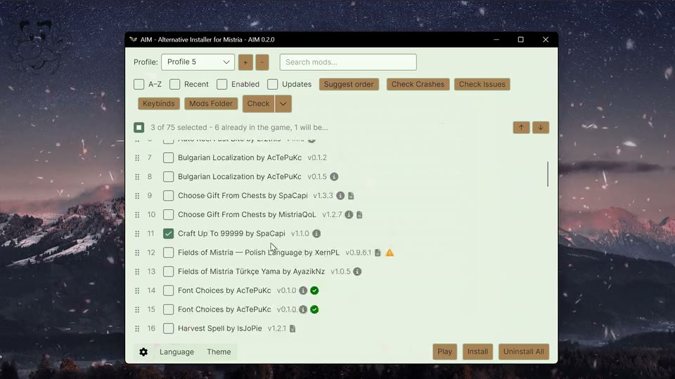

# AIM — Alternative Installer for Mistria 0.2.1

This is an independently maintained alternative installer for **Fields of Mistria 1.0.x**, based on the open-source **Mods of Mistria Installer (MOMI)** project.

AIM is a fork of MOMI. It was renamed to avoid confusion between the two applications while preserving the upstream history, attribution, and technical compatibility. AIM is not affiliated with or endorsed by the original MOMI project.

AIM is not intended to replace MOMI. It exists to provide capabilities that are currently needed by this fork while remaining compatible with the upstream project. If MOMI later adopts at least the capabilities that motivated this fork and fully meets the project's needs, AIM may be retired in favour of the upstream project.

The current AIM development line is `0.2.1`.

     

## Preview

Visual preview of AIM: language switching, mod installation and removal, load-order management, mod selection, and installation status messages.

## Fork-specific improvements

Compared with the upstream 0.15.10 line, this fork focuses on Fields of Mistria 1.0.x support and safer everyday use:

- Rebuilds are staged from a verified pristine archive and validated before the live `assets.zip` is replaced.
- Failed installations keep the previous working archive and provide a mod-specific diagnostic log where possible.
- TOML validation, custom font installation and manual-load animation content are supported for current 1.0.x mods.
- The UI remembers profiles, load order, theme and text-size preferences; behaves better on high-DPI displays; and includes a guarded **Play** button.
- Update checks, release uploads and the GitHub link belong to this fork rather than the upstream repository.

## Nexus integration and mod list tools

Nexus account features are implemented with OAuth PKCE. Nexus has registered AIM as a public OAuth
client; AIM does not accept or fall back to personal Nexus API keys.

| What | Where it lives in the UI |
| --- | --- |
| Nexus **Vortex download button** (`nxm://`) links download and unpack straight into the mods folder after OAuth sign-in | Gear menu → **Nexus downloads** |
| Check one mod, the selected mods, or every mod for updates after OAuth sign-in | Right-click a mod, or gear menu → **Nexus downloads** |
| Update a mod from Nexus, keeping the previous version as a backup you can restore after OAuth sign-in | Right-click a mod |
| Freeze a mod so update checks leave it on the version it is on | Right-click a mod |
| Open a mod's Nexus page or its folder | Right-click a mod |
| Edit a mod's manifest or config file in your usual text editor | Right-click a mod |
| Remove a mod from the mods folder, via the Recycle Bin | Right-click a mod → **Remove mod…** |
| Mark a reported conflict as one you have checked and are happy with | **Check issues** → tick the box beside it |
| Remove every ticked mod at once | Gear menu → **Remove selected…** |
| Sort the list A–Z, or show only mods needing attention, without changing load order | Checkboxes above the mod list |
| Jump to the top or bottom of a long mod list | **↑** / **↓** buttons above the mod list |
| See and edit every keybind and controller button your mods use, with clashes in red | **Keybinds** button above the mod list |
| Keep the keybinds you chose when a mod resets its own settings | Automatic — AIM asks before restoring |
| Check for updates, and install everything that has one | **Check updates** button above the mod list |
| Install one mod's update in place, keeping the old version | Green **Update** badge on the mod's row |
| Roll a mod back to any earlier copy AIM kept, not just the newest | **Versions** dropdown on the mod's row |
| Read what changed in a mod, this version or any earlier one | Document icon after the mod's version |
| Move recognised hand-downloaded mods from any watched folder into the selected Mods folder | Gear menu → **Watched download folders** → **Watch a folder…** |
| Decide which mod wins a shared file, from inside the conflict report | **Check issues** → expand a finding → **Make this one win** |
| Look up whether a conflict is known, patched, or harmless | **Check issues** → expand a finding → **Find a fix…** |
| Move a mod off a clashing keyboard shortcut | **Check issues** → expand a shortcut clash → **Rebind…** |
| Select or clear every mod at once, with a summary of what the selection means | Checkbox above the mod list |
| **Suggest order** — order mods so each loads after what it requires, and report what it cannot decide | Button above the mod list |
| Mods copied into the mods folder appear without reopening AIM | Automatic |

Full details are in the [Nexus download guide](docs/USER_GUIDE.md#downloading-mods-from-nexus-vortex-download-button),
[mod list tools](docs/USER_GUIDE.md#mod-list-tools), and [appearance guide](docs/USER_GUIDE.md#appearance-and-text-size).

### What it does not change

- Installing still rebuilds `assets.zip` from the pristine backup using the mods that are ticked, so
  a ticked mod means "in the game" and nothing is unticked for you. Downloading a mod does not install
  it; it appears in the list and waits for **Install** like any other mod.
- ZIP and RAR mods are still read in place. A downloaded archive is unpacked because AIM knows it is
  a fresh download, but an archive you drop in yourself is left exactly as it is.
- No existing file format or profile changes. The new state lives in three new
  files: `aim_nexus.json` and `aim_dismissed_issues.json` in the mods folder, and `nexus.json` in
  `%LOCALAPPDATA%\AIM`.

## What this fork supports

- Fields of Mistria 1.0.x mod installations.
- Mod folders, ZIP archives, and RAR archives containing either `manifest.toml` or `manifest.json`.
- ZIP and RAR mods are read directly by AIM; extracting them first is optional. AIM can locate the mod manifest inside a supported wrapper folder, but it does not search through unlimited nested folders.
- TOML, JSON, image, outfit, furniture, item, object, store, shadow, font and manual-load mod content supported by the current AIM installer modules.
- GML mods using the MMAPI format documented in [`docs/MMAPI`](docs/MMAPI); MMAPI compatibility is retained from the upstream project.
- Profiles and persisted mod load order.
- Rebuilding `assets.zip` from a verified pristine backup, so disabled or removed mods are removed on the next successful rebuild.
- Staged installation diagnostics, archive validation and recovery when an installation fails.
- A Play button that is available when the game can be launched, including before any mod is installed.
- Play uses Steam by default. Enable **Launch game directly** from the gear menu to launch the detected `FieldsOfMistria.exe` instead; the preference is saved between launches and falls back to Steam if direct launching is unavailable.
- At startup, AIM performs an experimental advisory scan of discovered mods for known legacy GML, hook and loading-screen signatures. It does not block those mods automatically; the warning icon and its hover text explain the detected risk.
- Before installation, AIM also checks selected mods for shared destination files and detectable keyboard-shortcut conflicts. These checks are warnings unless the selected mods cannot safely be combined.

This project is intended for Fields of Mistria 1.0.4 and later 1.0.x patches. Individual mods may still require a specific AIM version or game patch; check the mod author's compatibility notes.

## Documentation

The detailed documentation is split by audience:

- [User guide](docs/USER_GUIDE.md) — installation, Nexus downloads, mod list tools, updates, and troubleshooting.
- [CLI reference](docs/CLI.md) — command-line installation, diagnostics, dry-run preflight, and JSON/TOML reports.
- [MMAPI documentation](docs/MMAPI) — hooks, seams, manifests, and mod-author guidance.
- [Development guide](docs/DEVELOPMENT.md) — building, testing, licensing, and release workflow.

## Contributors

See [Contributors.md](Contributors.md) for the people who have contributed to
AIM and the areas they worked on.

## Development

See the [development guide](docs/DEVELOPMENT.md) for build, test, licensing, and release instructions.

## Project metrics

Project traffic is tracked by [`repo-metrics`](https://github.com/AcTePuKc/repo-metrics) from the first successful collection date. See the [full portfolio dashboard](https://github.com/AcTePuKc/repo-metrics/blob/main/PORTFOLIO.md) for the wider project overview.

## Licensing

This project is licensed under GPLv3 or later (see `LICENCE.txt`).

The MMAPI framework in `ModsOfMistriaInstallerLib/Seam/Payload/mmapi` is
copyright © 2026 AnnaNomoly and is licensed under GPLv3 or later with
additional terms under GPLv3 section 7. Those terms require preservation of
the copyright, licence, and attribution notices, prohibit misrepresentation
of origin, and grant no trademark rights to the MMAPI name or branding. They
are included in `ModsOfMistriaInstallerLib/Seam/Payload/mmapi/LICENSE`, and
the MMAPI source files retain their licence headers.

The MMAPI seam catalog contains excerpts of Fields of Mistria game code used
as anchor patterns. That content belongs to NPC Studio; see the notice at the
top of `ModsOfMistriaInstallerLib/Seam/Payload/seams.toml`.
